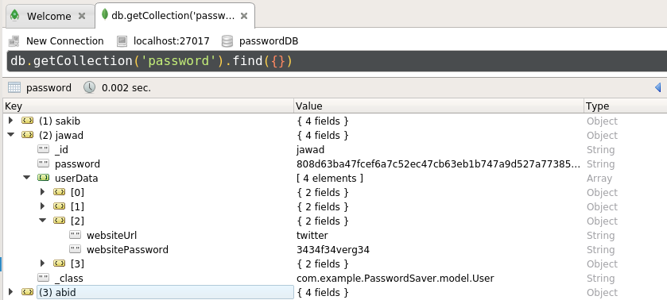

# Password Saver Application
  
  Password manager Applicaion with Vue.js frontend and SpringBoot backend.
  
<div id="top"></div>

<!-- TABLE OF CONTENTS -->

## Table of Contents

  <ol>
    <li>
      <a href="#about2">About The Project</a>
      <ul>
        <li><a href="#build3">Structure</a></li>
        <li><a href="#build2">Built With</a></li>
      </ul>
    </li>
    <li><a href="#usage2">Usage</a></li>
    <li><a href="#usage3">Working mechanism</a></li>
    <li><a href="#contact2">Contact</a></li>
  </ol>


<div id="about2"></div>


<!-- ABOUT THE PROJECT -->

## About The Project

In this project, for frontend part, **Vue.js** framework is used, and **SpringBoot** for the backend. In the backed for storing data **mongDB** is used. SpringBoot serves **REST** services so that frontend part can communicate. See <a href="#usage3">this section</a> for detailed information. I depolyed this full stack project on **Heroku** so I suggest to take a look directly - https://pass-word-saver.herokuapp.com/ (it may take a little longer  than usual at it's first load, as heroku server sleep after 30 minutes of inactivity).

<p align="right">(<a href="#top">back to top</a>)</p>


<div id="build3"></div>

## Structure
  
### Dependency
* **Backend** 
  Dependecy imported and used for SpringBoot framework -
  * Spring Data MongoDB
  * Spring Web
  * Spring Boot DevTools
* **Frontend** 
  Dependecies used in Vue.js framework -
  * Axios
  * Cryptojs
  * Vue-Router

### Directory
* Directory structure of **backend** part -
```
.
└── backend/src/main/java/com/example/PasswordSaver/
    ├── PasswordSaverApplication.java
    ├── RestServiceCorsApplication.java
    ├── model/
    │   ├── User.java
    │   └── UserData.java
    ├── controller/
    │   └── PasswordSaverController.java
    ├── repository/
    │   └── UserRepository.java
    ├── service/
    │   ├── UserService.java
    │   └── UserServiceImpl.java
    └── config/
        └── MongoDbConfig.java
```  
* Directory structure of **frontend** part -
```
.
└── frontend/
    ├── PasswordSaverApplication.java
    ├── RestServiceCorsApplication.java
    ├── models/
    │   └── Item.js
    ├── src/
    │   ├── App.vue
    │   ├── assets/
    │   │   └── SecureStyle.css
    │   ├── components/
    │   │   ├── login.vue
    │   │   └── secure.vue
    │   ├── main.js
    │   └── router/
    │       └── index.js
    └── package.json
```  
<p align="right">(<a href="#top">back to top</a>)</p>    

<div id="build2"></div>

## Built With

### Technology used

  * SpringBoot
  * Java
  * MongoDB
  * Vue.js

### Software used
  
  * Postman (for API testing)
  * Editor (VScode/Sublime)
  * Robo3t (for visualizing mongoDB database)
  * MongoDB compass
  * Heroku CLI
  
<p align="right">(<a href="#top">back to top</a>)</p>


<div id="usage2"></div>


<!-- USAGE EXAMPLES -->
## Usage

I've attached here some preview of this project. Although i'll strongly recommend to visit the site to have a better overview.
* User **register** and **login**  -

* Password **saving**, **editing** and **deleting** -


<p align="right">(<a href="#top">back to top</a>)</p>


<div id="usage3"></div>


<!-- USAGE EXAMPLES -->
## Working mechanism

  * **SpringBoot** as a backend framework, serves all REST API to communicate.
  * In the backend, **MongoDB** is used for keeping all data stored. I used **mongoDB atlas** cloud storage to keep data.
  * From the frontend, **Vue.js** communicate via CRUD operations, which is performed by **Axios** library.
  * For securing password, **SHA3** hash algorithm is used which is brought by importing and using **CryptoJS** vue library.
  Here is an image of database structure (**robo3t** representation) -
  

  * In local testing, Vue.js front runs in http://localhost:8080/ and communicate via API with springboot on http://localhost:8888/. Although server port can be configure according to wish as **CORS** error is handled. Need to change CORS `allowedOrigins` when to test locally, currently it is set for **heroku** server.
 

  

   
 
    
<p align="right">(<a href="#top">back to top</a>)</p>


<div id="contact2"></div>


<!-- CONTACT -->
## Contact

You may contact with me via gmail if needed. All necessary contact info you will find at - 
<a href="https://hurutta.github.io"> my website. <a>


<p align="right">(<a href="#top">back to top</a>)</p>


